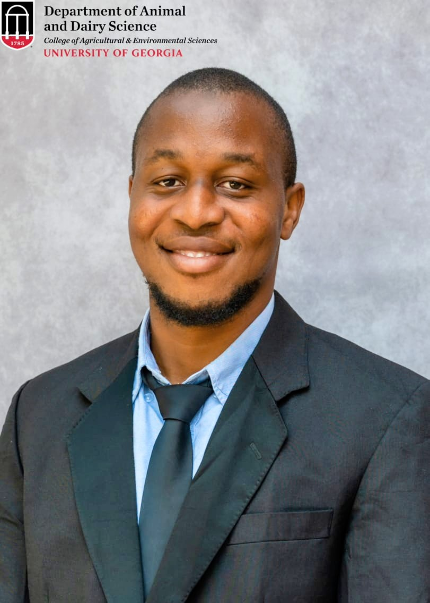
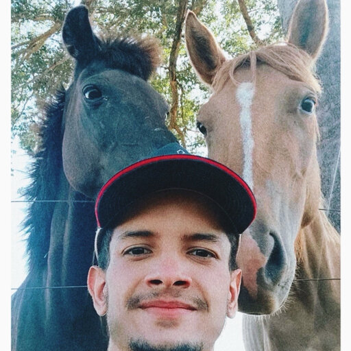

## Current Lab Members

  
  

    
      Anderson A. C. Alves 
      
     
    Principal Investigator 
    Ph.D. Animal Breeding and Genetics 
    Sao Paulo State University, Brazil 
    <strong style="font-size: .90em;">**email**: alvesand@uga.edu</strong> 
    [Faculty Page](https://www.caes.uga.edu/about/personnel/person/24103/anderson-alves.html) 
    [Google Scholar Profile](https://scholar.google.com/citations?user=_JLXWlkAAAAJ&hl=pt-BR) 
    [CV](https://github.com/alvesand/CV/blob/main/CV-master/CV.pdf) 
  

  
  

    
      Jordan M. Hooker 
      
      
    M.S. Student 
    B.S. Oklahoma State University 
    Research Area: Precision Dairy Science 
    <strong style="font-size: 1.0em;">**email**: jordan.hooker@uga.edu</strong> 
  

  
  

    
      Taofeek Abdulrahman 
      
     
    M.S. Student 
    B.S. Animal Breeding and Genetics, Federal University of Agriculture, Abeokuta, Nigeria 
    <strong style="font-size: .90em;">**email**: taofeekabdulrahman@uga.edu</strong> 
    Research Area: High-throughput Phenotyping/Genetics 
  

  
  

    
      Bruno B. Medeiros 
      
     
    Ph.D. Student 
    B.S. Veterinary Medicine (DVM), Federal University of Goiás, Brazil 
    <strong style="font-size: 1.0em;">**email**: bruno.medeiros@uga.edu</strong> 
    Research Area: High-throughput Phenotyping/Genetics 
  

  
  

    
      Chamak Saha 
      
     
    M.S. Student 
    B.S. Computer Science and Engineering, BRAC University, Bangladesh 
    <strong style="font-size: .90em;">**email**: chamak.saha@uga.edu</strong> 
    Research Area: Computer Vision, Applied AI 
    [Google Scholar Profile](https://scholar.google.com/citations?user=YkEtM7oAAAAJ&hl=en)  
  

