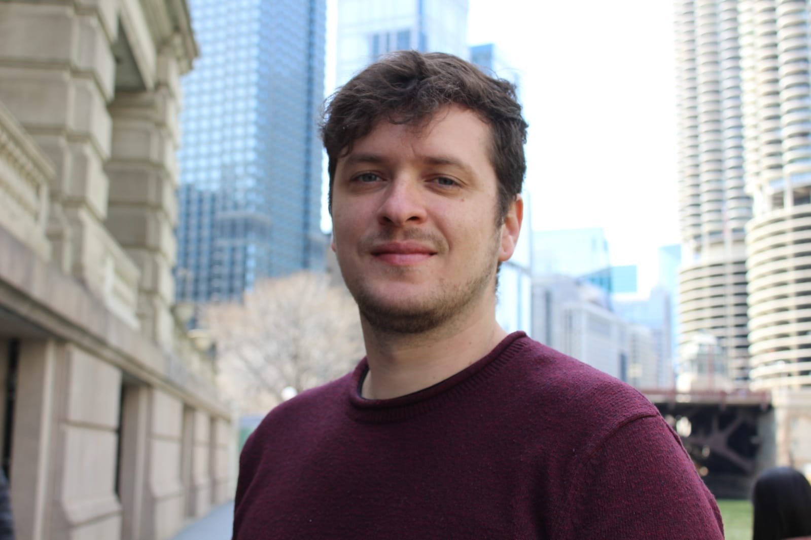

## *Anderson A. C. Alves*

Dr. Anderson Alves will be joining the Department of Animal and Dairy Science at UGA as an Assistant Professor in Precision Livestock Science. Originally from Brazil, Dr. Alves earned his Master's and Doctoral degrees in Animal Science and Animal Breeding and Genetics from the Federal University of Ceara (2016) and Sao Paulo State University (2019), respectively. He served as a Lecturer at the Federal Institute of Education, Science, and Technology of Maranhao (Brazil) until 2021, when he joined the University of Wisconsin-Madison to work as a Research Associate.

At UGA, Dr. Alves's research agenda will center on harnessing sensor technologies and artificial intelligence (AI) techniques to support efficient and sustainable livestock farming, driven by non-invasive and automated methods for monitoring welfare, health, and production indicators in Dairy Cattle and other livestock species. His research group will focus on the development and application of efficient statistical learning methods and computational tools for the analysis of high-dimensional livestock data derived from different sources, including cameras, acoustic sensors, farm records, radio-frequency systems, and modern molecular information. Examples of applications include the use of computer vision systems to monitor individual behavior in dairy cows, enabling early disease prediction, estrus detection, and identification of heat stress indicators.

* Originally posted at [CAES Fall Newsletter](https://animaldairy.uga.edu/about/newsletters/fall-2023/meet-our-new-faculty.html)