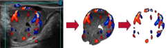

```{r setup, include=FALSE}
knitr::opts_chunk$set(echo = FALSE)
```

The <span style="color: red;">[Institute for Integrative Precision Agriculture](https://iipa.uga.edu/)</span> has awarded our lab a seed grant to investigate the suitability of applying deep learning algorithms for ultrasound image analysis to support
reproductive management decisions in Cattle. 

The constant advances in bovine ultrasound (US) technology, including size reduction, higher level of autonomy, better image quality, and price decreases have contributed to the spread of this technology as a common diagnostic method to assist reproduction management in beef and dairy cattle. Nonetheless,
acquisition, processing, and interpretation of US-based images are time-consuming, require highly trained personnel, and might present high inter- and intra-observer variability. These limitations comprise a major challenge for large-scale application of this technology in farm conditions. The use of artificial intelligence techniques could assist the systematic evaluation of US images, contributing to the automation of complex tasks such as classifying and segmenting US-based scans, or detecting objects of interest in such imagery. The implementation of deep learning (DL) algorithms for ultrasound analysis might contribute to
facilitating image interpretation, decrease misdiagnosis, and optimize workflow on the farm. In this project, we will develop computer vision systems using deep learning algorithms to process and classify ultrasound images, aiming to generate on a large scale, image-driven reproductive indicators that can be used to
support reproductive management decisions in cattle. Hundreds of ultrasound images will be collected in beef cows during their breeding and gestation stages. A deep neural network approach called Mask-RCNN will be implemented to generate segmented areas for the regions of interest (fetus and corpus luteum). After
this preliminary step, the pixel information from the segmented regions will be fed into convolution neural networks (CNN) to predict different fetal measurements predictions based on traditional B-mode US images. Additionally, the probability of pregnancy maintenance will be predicted based on Color Doppler
(CD) ultrasonography. The outcomes of the proposed project are expected to assist veterinarians and farmers in optimizing management decisions promptly, contributing to enhancing reproductive efficiency in the cattle industry. 


