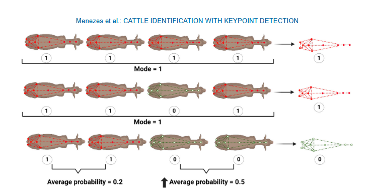

```{r setup, include=FALSE}
knitr::opts_chunk$set(echo = FALSE)
```


We are thrilled to announce that our latest research in partnership with UW-Madison has been published in <span style="color: red;"> [Journal of Dairy Science](https://doi.org/10.3168/jds.2024-26069)</span>.

In this study, we explored artificial intelligence techniques to identify cows independently of their color pattern. 

Computer vision systems offer identification solutions for animals with distinct coat patterns but are less effective for solid-colored herds. Another complication in real-world conditions is when new animals are introduced or removed from the herd, representing a challenge known as the open-set scenario. A promising alternative for identifying solid-colored animals is to use keypoints, similar to recognition systems that use parts of the human face and body. However, body growth can alter biometric features over time, potentially affecting model accuracy. Therefore, this study aims to (1) evaluate the capacity to automatically identify dairy cows using keypoints at specific anatomical landmarks (i.e., bony prominences) and determine the number of images necessary to train the model; (2) assess the effect of body biometric features perturbations (i.e., a controlled increase in biometric feature size simulating body growth variations over time in the testing set) on the identification accuracy; and (3) evaluate the capacity to automatically identify dairy cows using keypoints in open-set scenarios. A pose estimation model was trained to identify 10 keypoints per cow, located at anatomical landmarks. The Euclidean distance between these keypoints was used to generate biometric features for each cow. This trained pose estimation model was used to predict keypoints on a total of 118 videos containing 41 individual cows. Three strategies were applied using all 10 keypoints over the whole body (strategy 1) or 8 keypoints on the back of the cow (strategy 2), simulating occlusion on the neck and head, or 6 keypoints from the rump (strategy 3) to investigate the accuracy of identifying the cow when only the rump is visible. These strategies resulted in a total of 3,143; 6,650; and 11,499 predicted frames, respectively. For cow identification, a Siamese neural network was trained using the biometric features extracted from the keypoints. Three experiments were tested: (1) closed set scenarios and sample size for model training; (2) closed set with perturbation of 2%, 4%, 7% and 9%; and (3) open set considering 20% of the herd as new cows. In the closed set, the best result was observed using strategy 1, showing an accuracy, precision, recall, and F1-score of 96.3%, 96.3%, 96.0%, and 95.9%, respectively. Training the model with 18 images per class (i.e., individuals) achieved over 80% accuracy at the frame level. After applying perturbation in the closed set, only the strategy with 2% perturbation showed satisfactory results. In open-set scenarios, the model achieved an accuracy, precision, recall, and F1-score of 72.5%, 100%, 72.5%, and 84.1%, respectively, in identifying the new cows. Considering both the open and closed set scenarios without perturbation, the model showed an accuracy, precision, recall, and F1-score of 75.4%, 79.5%, 76.7%, and 75.8%, respectively. These results suggest that strategy 1, using Euclidean distances between the 10 keypoints, can effectively identify individual animals of similar color.



