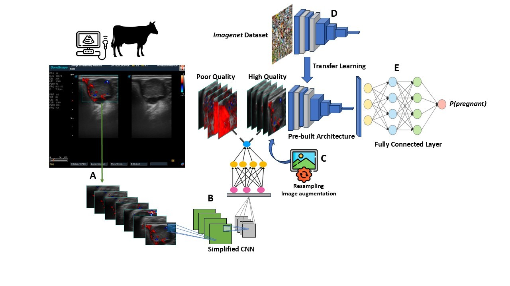

```{r setup, include=FALSE}
knitr::opts_chunk$set(echo = FALSE)
```

We are thrilled to announce that our latest research on computer vision analysis of luteal color Doppler ultrasonography for early and automated pregnancy diagnosis in beef cows has been published in the <span style="color: red;"> [Journal of Animal Science](https://academic.oup.com/jas/advance-article/doi/10.1093/jas/skaf166/8129065#518108568)</span>.

This study evaluated the potential of deep learning (DL) algorithms to support early and
real-time pregnancy diagnosis in beef cattle using Color Doppler (CD) ultrasonography. To train
the DL algorithms, 10,533 and 10,413 frames were extracted from ultrasound videos recorded 20
and 22 days after artificial insemination (AI), respectively. Pregnancy status for each cow was
confirmed on day 29 using conventional ultrasonography, which served as the ground truth for
comparing the accuracy of both human and DL-based predictions. The DL algorithms achieved
up to 91% accuracy, closely matching the performance of trained veterinarians under controlled
conditions (93%). These findings demonstrate that DL algorithms combined with CD
ultrasonography can reliably predict pregnancy status earlier than industry-standard methods,
with performance comparable to skilled personnel. This approach shows promise for improving
workflow efficiency in commercial beef cattle reproductive management.


