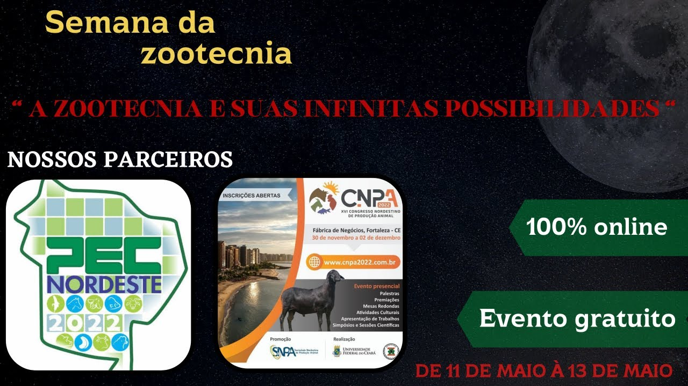

<iframe width="560" height="315" src="https://www.youtube.com/embed/EmooJrG6uow" title="YouTube video player" frameborder="0" allow="accelerometer; autoplay; clipboard-write; encrypted-media; gyroscope; picture-in-picture; web-share" allowfullscreen></iframe>

**#03 - Genômica × Zootecnia de precisão: Como o melhoramento genético de aves está avançando?**

A nice chat for the *O Aviario Podcast* show, where we discuss the recent advances in genomics and precision livestock farming applied to poultry production. [*In portuguese*]

<iframe width="560" height="315" src="https://www.youtube.com/embed/V60lpNTEsVs" title="YouTube video player" frameborder="0" allow="accelerometer; autoplay; clipboard-write; encrypted-media; gyroscope; picture-in-picture" allowfullscreen></iframe>  
**#12 - Dr. Anderson Alves: Genetics, machine learning, and technology**    
My participation in the Poultry Podcast Show    

<iframe width="560" height="315" src="https://www.youtube.com/embed/U6iGEbTS8FA" title="YouTube video player" frameborder="0" allow="accelerometer; autoplay; clipboard-write; encrypted-media; gyroscope; picture-in-picture" allowfullscreen></iframe>  
**CGIL seminar Winter 2022 - Dr. Anderson Alves**  
My talk for the CGIL (Centre for Genetic Improvement of Livestock) Winter Seminar at the University of Guelph.

\
&nbsp;

[{width=60%}](https://www.youtube.com/watch?v=Me3nqEwIkz8&ab_channel=ABZCear%C3%A1)  

**SNCT 2020 - IFMA SRM: Palestras de 04/11/2020 (Manhã)**    

An informal conversation hosted by the ABZ-CE (Brazilian Association of Animal Science, Ceara State) about the potential and skills of the animal scientist. (In portuguese) 

